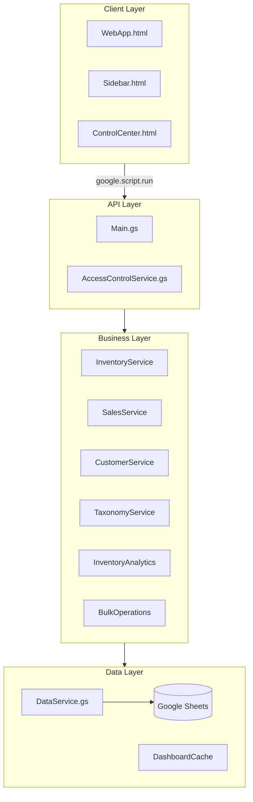
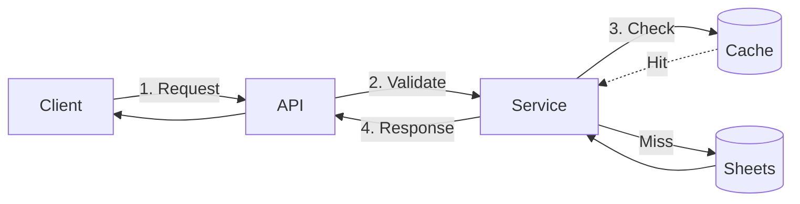
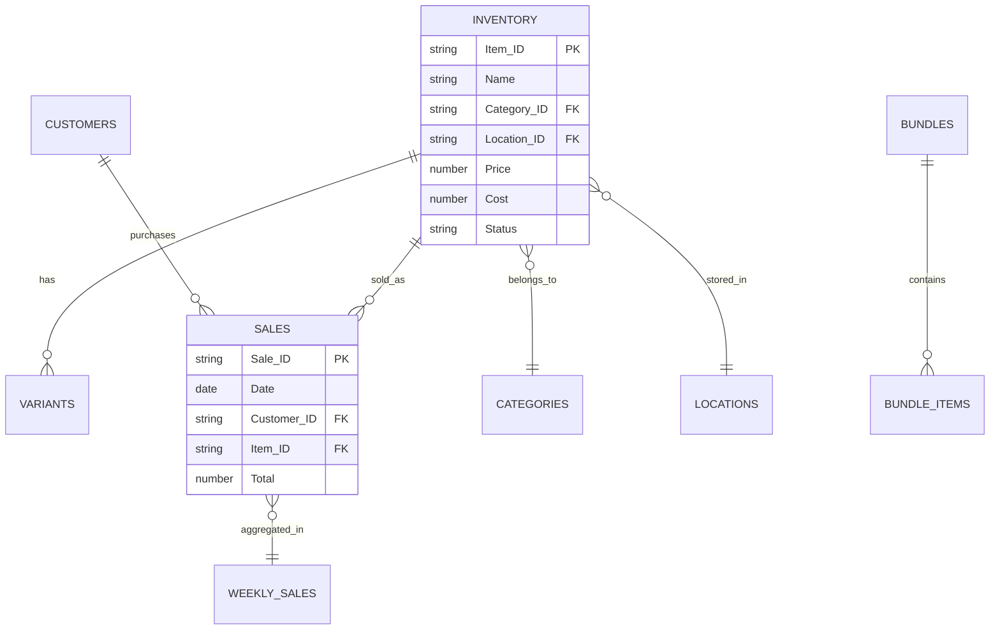

# Rosewood Antiques v2

<div align="center">


**A modern inventory management system for antique dealers, built with Google Apps Script.**

[Features](#features) • [Architecture](#architecture) • [Quick Start](#quick-start) • [Documentation](#documentation)

</div>

---

## Features

| Feature | Description |
|---------|-------------|
| **Inventory Management** | Track items with variants, bundles, categories, locations, and tags |
| **Sales Tracking** | Record sales, generate weekly summaries, analyze performance |
| **Customer Management** | Maintain customer records and purchase history |
| **Dashboard Analytics** | Real-time health scoring, action items, and performance charts |
| **Bulk Operations** | Batch updates, imports, exports with safety guards |
| **Access Control** | Owner, domain, and passphrase-based authentication |

---

## Architecture



### Data Flow



---

## File Structure

| Server Files (.gs) | Purpose |
|-------------------|---------|
| `Main.gs` | Entry points, menu handlers, API functions |
| `Config.gs` | Business rules, sheet definitions, constants |
| `DataService.gs` | CRUD operations, caching, batch processing |
| `InventoryService.gs` | Item CRUD, variants, bundles |
| `SalesService.gs` | Sales transactions, weekly aggregation |
| `CustomerService.gs` | Customer CRUD and stats |
| `TaxonomyService.gs` | Categories, locations, tags |
| `BulkOperations.gs` | Batch operations, CSV import/export |
| `AccessControlService.gs` | Authentication and authorization |

| Client Files (.html) | Purpose |
|---------------------|---------|
| `WebApp.html` | Standalone web application |
| `ControlCenter.html` | Full-viewport control center |
| `Sidebar.html` | Google Sheets sidebar |
| `Dialogs.html` | Modal dialogs for CRUD |
| `SharedStyles.html` | CSS design system |

---

## Quick Start

```bash
# Install clasp globally
npm install -g @google/clasp

# Login and create project
clasp login
clasp create --type sheets --title "Rosewood Antiques"

# Push code and open
clasp push
clasp open
```

Run `onOpen()` from the script editor to create the Rosewood menu.

---

## Data Model



**14 Sheets**: Inventory, Variants, Bundles, Bundle_Items, Categories, Locations, Tags, Item_Tags, Sales, Weekly_Sales, Customers, Settings, Activity_Log, Dashboard_Cache

---

## Configuration

Key settings in `Config.gs`:

```javascript
BUSINESS_RULES: {
  AGING_THRESHOLDS: { FRESH: 30, NORMAL: 90, AGING: 180, STALE: 365 },
  LOW_STOCK_THRESHOLD: 2,
  LOW_MARGIN_THRESHOLD: 30,  // Percent
  TARGET_TURNOVER_RATE: 0.5
}
```

**Health Score Weights**: Turnover (25%), Aging (30%), Margins (25%), Velocity (20%)

---

## Access Control

Three authentication tiers:
1. **Script Owner** - Full access
2. **Domain Users** (@calebsandler.com) - Full access
3. **Passphrase** - Static or daily-rotating password

---

## Performance

| Operation | Time | Notes |
|-----------|------|-------|
| Dashboard (cached) | 50-200ms | Cache-first strategy |
| Dashboard (fresh) | 2-5s | Full recalculation |
| Inventory page | 300-800ms | Paginated (100 items) |
| Bulk ops (100 items) | 3-8s | Optimized batching |

---

## Documentation

| Document | Description |
|----------|-------------|
| [ARCHITECTURE.md](docs/ARCHITECTURE.md) | System architecture and design patterns |
| [DATABASE_SCHEMA.md](docs/DATABASE_SCHEMA.md) | Complete data model and relationships |
| [API_REFERENCE.md](docs/API_REFERENCE.md) | All API endpoints with examples |
| [CODE_ANALYSIS.md](docs/CODE_ANALYSIS.md) | Code quality analysis |
| [RECOMMENDATIONS.md](docs/RECOMMENDATIONS.md) | Completed refactoring items |

---

## Test Data

Use the Rosewood menu to generate test data:
- **Minimal**: 10 items, 2 sales
- **Medium**: 75 items, 20 sales
- **Full**: 200 items, 200 sales

> Test data generation is blocked in production mode.

---

<div align="center">

**Built with Google Apps Script**

</div>
