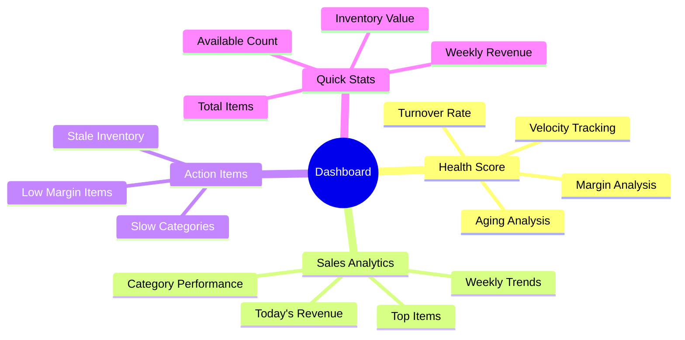
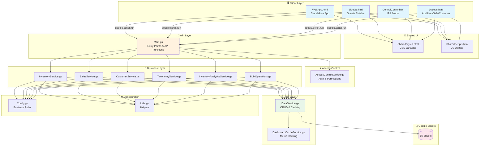
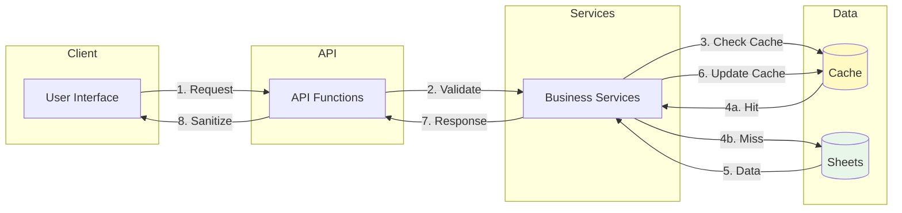
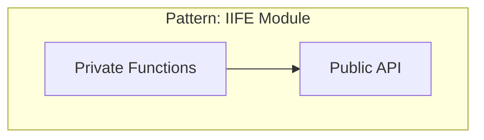
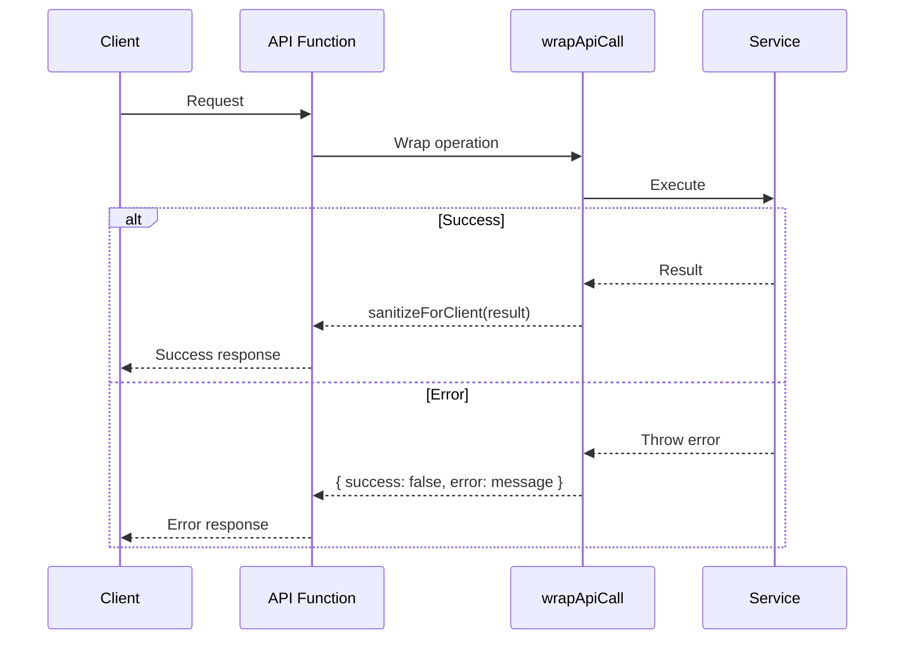
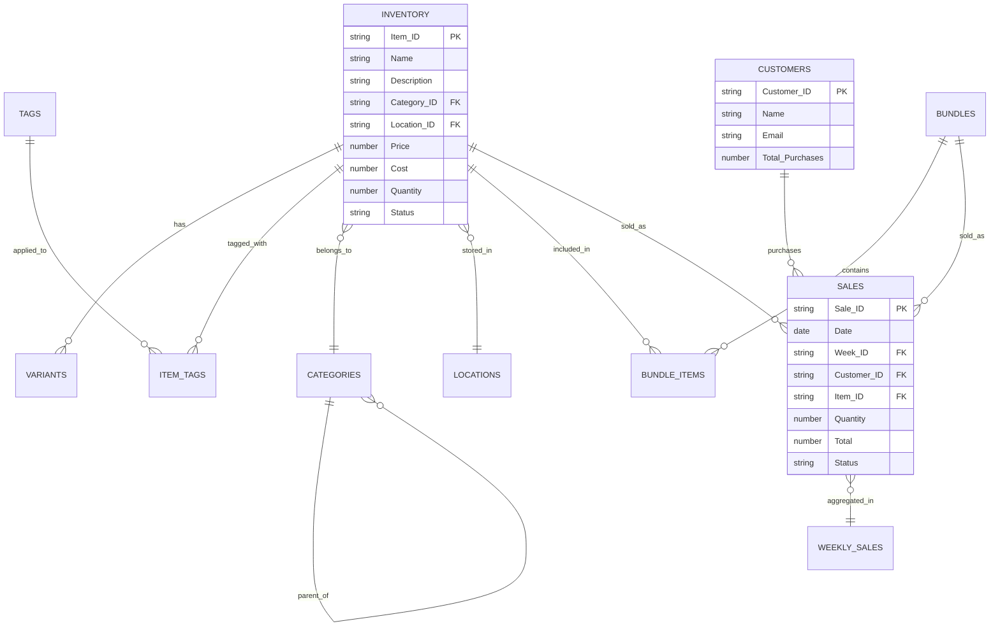
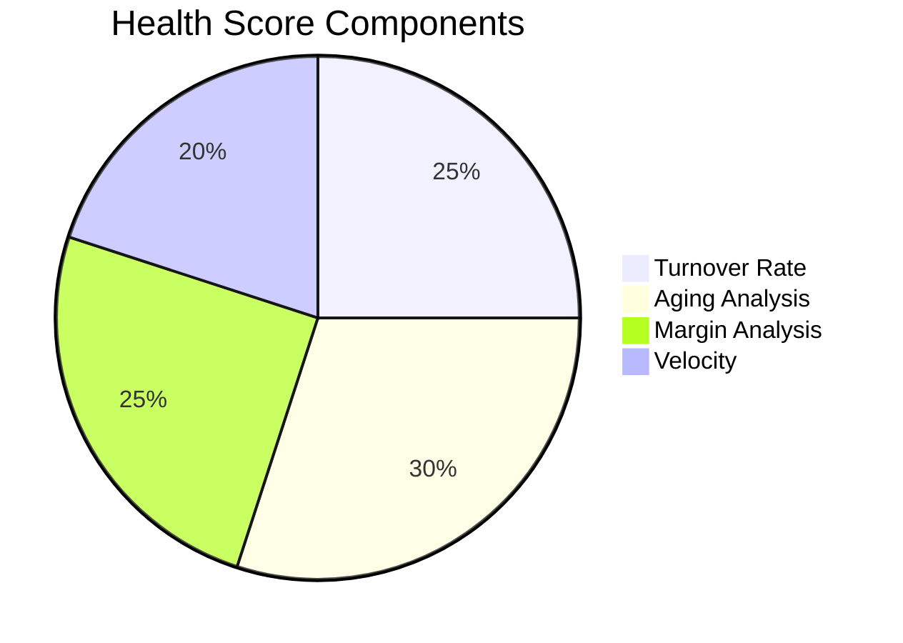

# Rosewood Antiques v2

<div align="center">


**A modern inventory management system for antique dealers, built with Google Apps Script.**

[Features](#-features) • [Architecture](#-architecture) • [Quick Start](#-quick-start) • [Documentation](#-documentation)

</div>

---

## ✨ Features

### Core Capabilities

| Feature | Description |
|---------|-------------|
| **📦 Inventory Management** | Track items with variants, bundles, categories, locations, and tags |
| **💰 Sales Tracking** | Record sales, generate weekly summaries, analyze performance |
| **👥 Customer Management** | Maintain customer records and purchase history |
| **📊 Dashboard Analytics** | Real-time health scoring, action items, and performance charts |
| **⚡ Bulk Operations** | Batch updates, imports, exports with safety guards |
| **🔐 Access Control** | Owner, domain, and passphrase-based authentication |

### Dashboard Metrics



---

## 🏗️ Architecture

### System Overview



### Data Flow



---

## 📁 File Structure

### Server-Side Files (.gs)

| File | Lines | Purpose |
|------|-------|---------|
| `Main.gs` | ~1,240 | Entry points, menu handlers, API functions |
| `Config.gs` | ~390 | Business rules, sheet definitions, constants |
| `Utils.gs` | ~420 | Validation, formatting, error handling |
| `DataService.gs` | ~700 | CRUD operations, caching, batch processing |
| `DashboardCacheService.gs` | ~500 | Pre-computed metrics with TTL |
| `InventoryService.gs` | ~560 | Item CRUD, variants, bundles |
| `SalesService.gs` | ~970 | Sales transactions, weekly aggregation |
| `CustomerService.gs` | ~110 | Customer CRUD and stats |
| `TaxonomyService.gs` | ~275 | Categories, locations, tags |
| `InventoryAnalyticsService.gs` | ~280 | Health scoring, action items |
| `BulkOperations.gs` | ~840 | Batch operations, CSV import/export |
| `AccessControlService.gs` | ~310 | Authentication and authorization |
| `TestDataGenerator.gs` | ~765 | Test data with production guards |

### Client-Side Files (.html)

| File | Lines | Purpose |
|------|-------|---------|
| `WebApp.html` | ~3,100 | Standalone web application |
| `ControlCenter.html` | ~3,125 | Full-viewport control center |
| `Sidebar.html` | ~2,540 | Google Sheets sidebar |
| `Dialogs.html` | ~1,005 | Modal dialogs for CRUD |
| `SharedStyles.html` | ~335 | CSS design system |
| `SharedScripts.html` | ~110 | Shared JavaScript utilities |

---

## 🚀 Quick Start

### Prerequisites

- [Node.js](https://nodejs.org/) (for clasp CLI)
- [clasp](https://github.com/google/clasp) - Google Apps Script CLI
- Google account with Sheets access

### Installation

```bash
# 1. Install clasp globally
npm install -g @google/clasp

# 2. Login to your Google account
clasp login

# 3. Clone or create a new Apps Script project
clasp create --type sheets --title "Rosewood Antiques"

# 4. Push the code
clasp push

# 5. Open the spreadsheet and run onOpen() to create the menu
```

### Development Workflow

```bash
clasp push          # Push local changes
clasp pull          # Pull remote changes
clasp push --watch  # Watch mode for development
clasp open          # Open in browser
clasp logs          # View execution logs
```

---

## 🎯 Key Design Patterns

### Service Architecture



All services use immediately-invoked function expressions:

```javascript
const InventoryService = (function() {
  // Private functions
  function privateHelper() { /* ... */ }

  // Public API
  return {
    getItems: function() { /* ... */ },
    createItem: function(data) { /* ... */ }
  };
})();
```

### Error Handling



### N+1 Query Prevention

```mermaid
graph LR
    subgraph "❌ N+1 Pattern"
        L1[Loop Items] --> Q1[Query 1]
        L1 --> Q2[Query 2]
        L1 --> Q3[Query N...]
    end

    subgraph "✅ Lookup Map Pattern"
        B1[Batch Load] --> M1[Build Map]
        M1 --> L2[Loop with O(1) Lookup]
    end
```

---

## 📊 Sheets Structure



### All Sheets (14 Total)

| Sheet | Purpose | Key Fields |
|-------|---------|------------|
| **Inventory** | Item records | ID, Name, Price, Cost, Quantity, Status |
| **Variants** | Size/color variations | Parent_ID, Type, Value, Price_Modifier |
| **Bundles** | Product bundles | ID, Name, Bundle_Price, Discount_Percent |
| **Bundle_Items** | Bundle contents | Bundle_ID, Item_ID, Quantity |
| **Categories** | Hierarchical categories | ID, Name, Parent_ID, Sort_Order |
| **Locations** | Storage locations | ID, Name, Capacity, Current_Count |
| **Tags** | Flexible tagging | ID, Name, Color |
| **Item_Tags** | Tag assignments | Item_ID, Tag_ID |
| **Sales** | Transactions | ID, Date, Item_ID, Customer_ID, Total |
| **Weekly_Sales** | Aggregated metrics | Week_ID, Revenue, Profit, Items_Sold |
| **Customers** | Customer records | ID, Name, Email, Total_Purchases |
| **Settings** | Configuration | Key, Value |
| **Activity_Log** | Audit trail | Timestamp, Action, Entity, User |
| **Dashboard_Cache** | Cached metrics | Key, Value, TTL, Category |

---

## ⚙️ Configuration

Edit `Config.gs` to customize:

### Business Rules

```javascript
BUSINESS_RULES: {
  AGING_THRESHOLDS: {
    FRESH: 30,    // Days
    NORMAL: 90,
    AGING: 180,
    STALE: 365
  },
  LOW_STOCK_THRESHOLD: 2,
  LOW_MARGIN_THRESHOLD: 30,  // Percent
  TARGET_TURNOVER_RATE: 0.5
}
```

### Health Score Weights



---

## 📚 Documentation

| Document | Description |
|----------|-------------|
| [ARCHITECTURE.md](docs/ARCHITECTURE.md) | Detailed system architecture and design patterns |
| [DATABASE_SCHEMA.md](docs/DATABASE_SCHEMA.md) | Complete data model and entity relationships |
| [API_REFERENCE.md](docs/API_REFERENCE.md) | All API endpoints with parameters and examples |
| [CODE_ANALYSIS.md](docs/CODE_ANALYSIS.md) | Code quality analysis and scoring |
| [RECOMMENDATIONS.md](docs/RECOMMENDATIONS.md) | Completed refactoring items |

---

## 🔐 Access Control

```mermaid
flowchart TD
    START([User Access]) --> CHECK_OWNER{Script Owner?}
    CHECK_OWNER -->|Yes| GRANTED[✅ Access Granted]
    CHECK_OWNER -->|No| CHECK_DOMAIN{@calebsandler.com?}
    CHECK_DOMAIN -->|Yes| GRANTED
    CHECK_DOMAIN -->|No| CHECK_PASS{Valid Passphrase?}
    CHECK_PASS -->|Yes| GRANTED
    CHECK_PASS -->|No| PROMPT[Show Passphrase Prompt]
    PROMPT --> CHECK_PASS

    style GRANTED fill:#c8e6c9
    style PROMPT fill:#fff9c4
```

### Passphrase Modes

- **Static**: Admin sets a fixed passphrase
- **Daily**: Auto-generated from seed + date (rotates at midnight)

---

## 📈 Performance

| Operation | Cached | Fresh | Notes |
|-----------|--------|-------|-------|
| Dashboard load | 50-200ms | 2-5s | Cache-first strategy |
| Inventory page (100) | 300-800ms | - | Paginated |
| Single CRUD | 200-500ms | - | Per operation |
| Bulk ops (100) | 3-8s | - | Optimized batching |
| Cache refresh | - | 3-8s | All metrics |

---

## 🧪 Test Data

Use the Rosewood menu to generate test data:

- **Minimal**: 10 items, 2 sales
- **Medium**: 75 items, 20 sales
- **Full**: 200 items, 200 sales

> ⚠️ Test data generation is blocked in production mode.

---

## 📄 License

Private project - All rights reserved.

---

<div align="center">

**Built with ❤️ using Google Apps Script**

</div>
