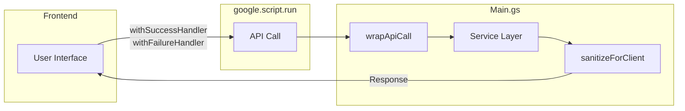
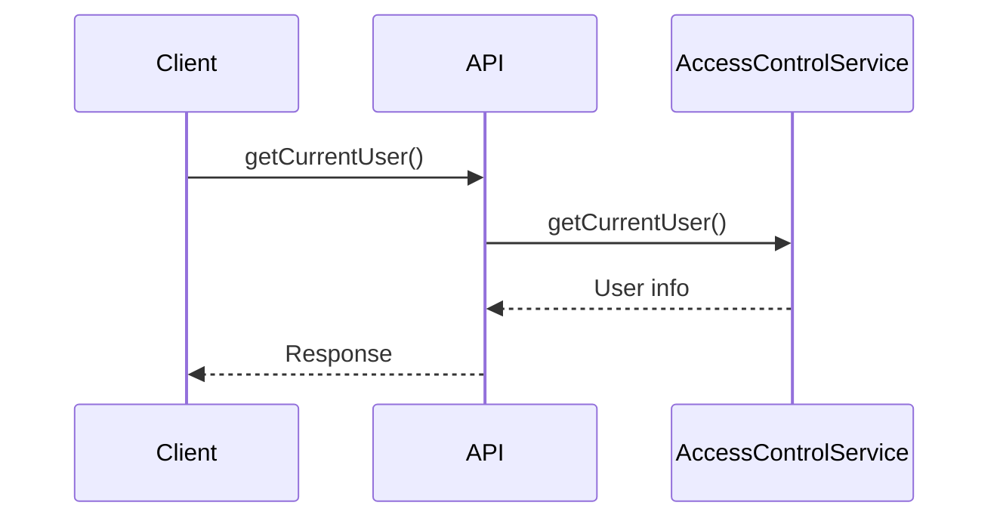
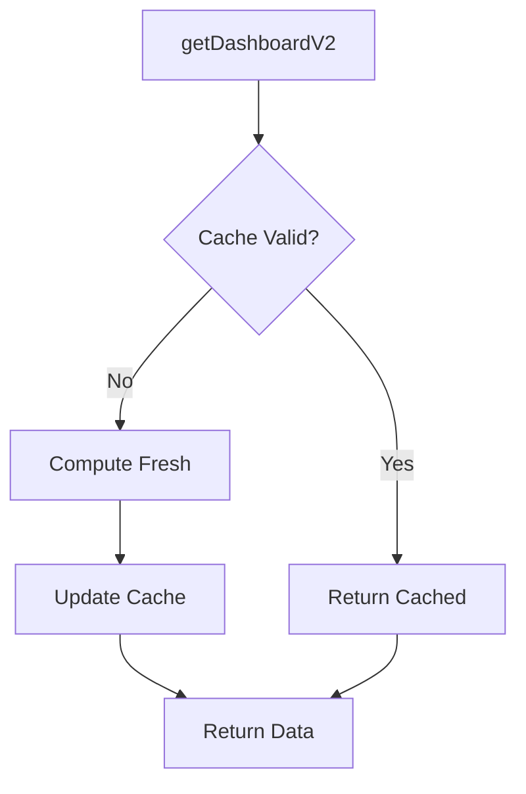
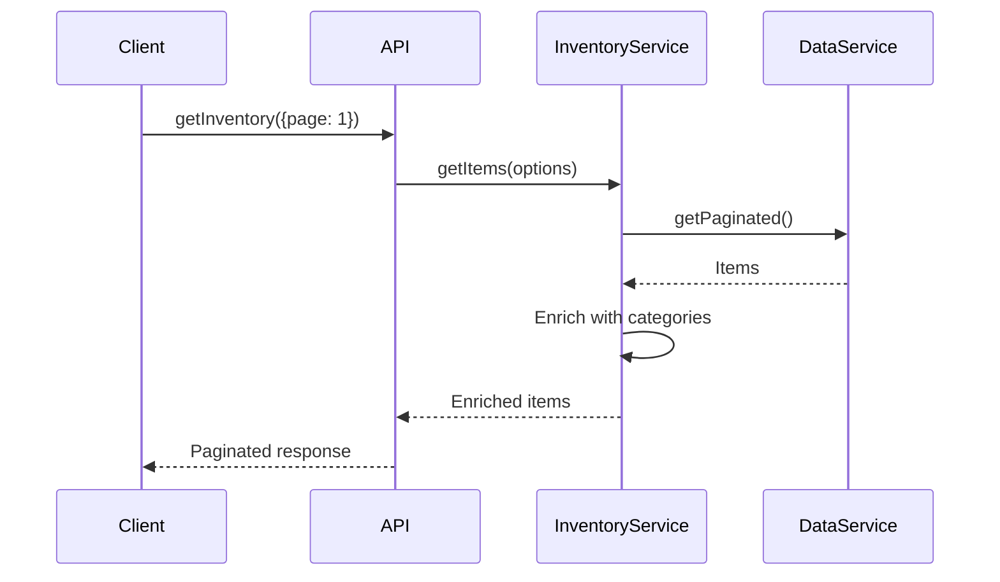
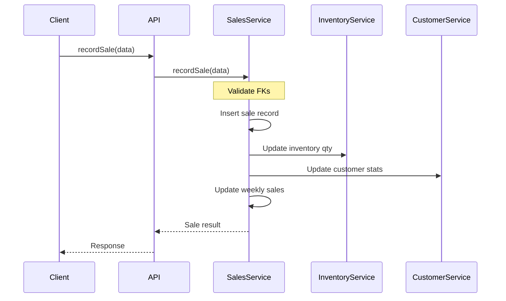
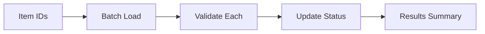
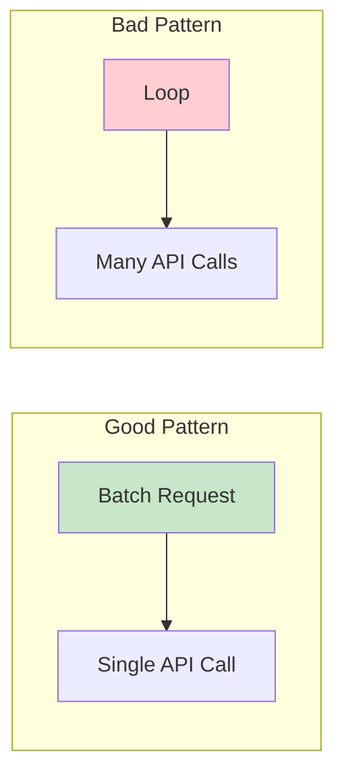

# API Reference

> **Version:** 2.1.0
> **Last Updated:** December 2024
> **Base:** Google Apps Script `google.script.run`

---

## Table of Contents

- [Overview](#overview)
- [Authentication APIs](#authentication-apis)
- [Dashboard APIs](#dashboard-apis)
- [Inventory APIs](#inventory-apis)
- [Sales APIs](#sales-apis)
- [Customer APIs](#customer-apis)
- [Taxonomy APIs](#taxonomy-apis)
- [Bulk Operations APIs](#bulk-operations-apis)
- [System APIs](#system-apis)
- [Error Handling](#error-handling)

---

## Overview

### API Architecture



### Standard Response Format

All API functions return responses in this format:

```javascript
// Success Response
{
  success: true,
  data: { /* result data */ },
  timestamp: "2024-12-27T10:30:00.000Z"
}

// Error Response
{
  success: false,
  error: "Error message",
  timestamp: "2024-12-27T10:30:00.000Z"
}
```

### Calling Pattern

```javascript
google.script.run
  .withSuccessHandler(function(response) {
    if (response.success) {
      // Handle success
      console.log(response.data);
    } else {
      // Handle error
      console.error(response.error);
    }
  })
  .withFailureHandler(function(error) {
    // Handle network/script error
    console.error(error.message);
  })
  .apiFunction(param1, param2);
```

---

## Authentication APIs

### getCurrentUser()

Get current user information and access status.



**Parameters:** None

**Returns:**
```javascript
{
  success: true,
  data: {
    email: "user@example.com",
    isOwner: true,           // Script owner
    isAllowedDomain: false,  // @calebsandler.com
    hasAccess: true,         // Combined access check
    requiresPassphrase: false
  }
}
```

---

### isOwner()

Check if current user is the script owner.

**Parameters:** None

**Returns:**
```javascript
{
  success: true,
  data: true  // or false
}
```

---

### verifyPassphrase(input)

Verify passphrase for external users.

**Parameters:**
| Name | Type | Required | Description |
|------|------|----------|-------------|
| input | string | Yes | Passphrase to verify |

**Returns:**
```javascript
// Valid
{
  success: true,
  data: {
    valid: true,
    expiresAt: "2024-12-28T10:30:00.000Z"
  }
}

// Invalid
{
  success: true,
  data: {
    valid: false,
    error: "Invalid passphrase"
  }
}
```

---

### getPassphraseSettings()

Get passphrase configuration (admin only).

**Parameters:** None

**Returns:**
```javascript
{
  success: true,
  data: {
    mode: "static",        // or "daily"
    expiryHours: 24,
    isConfigured: true,
    todaysPassphrase: "oak42cedar"  // Only in daily mode
  }
}
```

---

### setPassphraseSettings(settings)

Update passphrase configuration (admin only).

**Parameters:**
| Name | Type | Required | Description |
|------|------|----------|-------------|
| settings | object | Yes | Configuration object |

**Settings Object:**
```javascript
{
  mode: "static",           // or "daily"
  staticPassphrase: "xyz",  // For static mode
  seed: "rosewood",         // For daily mode
  expiryHours: 24           // Session duration
}
```

**Returns:**
```javascript
{
  success: true,
  data: {
    success: true,
    message: "Settings updated successfully"
  }
}
```

---

## Dashboard APIs

### getDashboardV2()

Get comprehensive dashboard data with caching.



**Parameters:** None

**Returns:**
```javascript
{
  success: true,
  data: {
    // Quick Stats
    inventory: {
      totalItems: 150,
      availableItems: 120,
      totalValue: 45000,
      totalCost: 28000
    },
    sales: {
      todayRevenue: 1250,
      weeklyRevenue: 8500,
      transactionCount: 45
    },

    // Health Metrics
    inventoryHealthScore: 78,
    turnoverRate: 0.45,
    agingItemCount: 12,
    blendedMargin: 38.5,
    averageVelocity: 28,

    // Action Items
    actionItems: [
      {
        type: "stale_inventory",
        priority: "high",
        message: "Victorian Desk listed 185 days at $450",
        itemId: "INV-123"
      }
    ],

    // Today Summary
    todaySummary: {
      revenue: 1250,
      itemsSold: 5,
      avgMargin: 42,
      vsLastWeek: 15.5,
      transactions: 3
    },

    // Charts
    categoryPerformance: [
      { category: "Furniture", revenue30d: 12500, velocity: 0.8 }
    ],
    weeklyRevenue: [
      { week: "2024-W52", weekStart: "2024-12-23", revenue: 8500 }
    ],

    fromCache: true
  }
}
```

---

### getQuickStats()

Get minimal dashboard data for fast initial load.

**Parameters:** None

**Returns:**
```javascript
{
  success: true,
  data: {
    totalItems: 150,
    availableItems: 120,
    totalValue: 45000,
    weeklyRevenue: 8500,
    fromCache: true
  }
}
```

---

### getChartData()

Get chart data for dashboard visualizations.

**Parameters:** None

**Returns:**
```javascript
{
  success: true,
  data: {
    categoryPerformance: [
      {
        category: "Furniture",
        revenue30d: 12500,
        velocity: 0.8,
        velocityTrend: "up",
        itemCount: 35
      }
    ],
    weeklyRevenue: [
      {
        week: "2024-W52",
        weekStart: "2024-12-23",
        revenue: 8500,
        itemsSold: 12
      }
    ],
    fromCache: true
  }
}
```

---

### getRecentActivity()

Get recent sales and items.

**Parameters:** None

**Returns:**
```javascript
{
  success: true,
  data: {
    recentSales: [
      {
        Sale_ID: "SLE-123",
        Date: "2024-12-27",
        Item_Name: "Victorian Chair",
        Total: 450,
        Status: "Completed"
      }
    ],
    recentItems: [
      {
        Item_ID: "INV-456",
        Name: "Art Deco Lamp",
        Price: 275,
        Date_Added: "2024-12-26"
      }
    ],
    fromCache: true
  }
}
```

---

### refreshDashboardCache()

Force refresh all dashboard cache metrics.

**Parameters:** None

**Returns:**
```javascript
{
  success: true,
  data: {
    success: true,
    duration: 3456,  // milliseconds
    metricsUpdated: 18
  }
}
```

---

## Inventory APIs

### getInventory(options)

Get paginated inventory items.



**Parameters:**
| Name | Type | Required | Default | Description |
|------|------|----------|---------|-------------|
| options.page | number | No | 1 | Page number |
| options.pageSize | number | No | 30 | Items per page |
| options.filters | object | No | {} | Filter criteria |

**Returns:**
```javascript
{
  success: true,
  data: {
    items: [
      {
        Item_ID: "INV-123",
        Name: "Victorian Writing Desk",
        Category_ID: "CAT-456",
        Category_Name: "Furniture",
        Price: 1250,
        Cost: 800,
        Quantity: 1,
        Status: "Available",
        Condition: "Excellent",
        Era: "1850-1900",
        Location_ID: "LOC-789",
        Date_Added: "2024-06-15T10:30:00.000Z"
      }
    ],
    page: 1,
    pageSize: 30,
    total: 150,
    totalPages: 5,
    hasMore: true
  }
}
```

---

### getItemDetails(itemId)

Get full details for a single item.

**Parameters:**
| Name | Type | Required | Description |
|------|------|----------|-------------|
| itemId | string | Yes | Item ID |

**Returns:**
```javascript
{
  success: true,
  data: {
    Item_ID: "INV-123",
    Name: "Victorian Writing Desk",
    Description: "Beautiful mahogany desk...",
    Category_ID: "CAT-456",
    Category_Name: "Furniture",
    Location_ID: "LOC-789",
    Location_Name: "Main Showroom",
    Price: 1250,
    Cost: 800,
    Quantity: 1,
    Status: "Available",
    Condition: "Excellent",
    Era: "1850-1900",
    SKU: "VWD-001",
    Notes: "Minor restoration needed",
    Date_Added: "2024-06-15T10:30:00.000Z",
    Date_Modified: "2024-12-20T14:00:00.000Z",
    variants: [
      {
        Variant_ID: "VAR-001",
        Variant_Type: "Color",
        Variant_Value: "Dark Mahogany",
        Price_Modifier: 0,
        Quantity: 1
      }
    ],
    tags: [
      { Tag_ID: "TAG-001", Name: "Featured", Color: "#00D9FF" }
    ]
  }
}
```

---

### createItem(data)

Create a new inventory item.

**Parameters:**
| Name | Type | Required | Description |
|------|------|----------|-------------|
| data | object | Yes | Item data |

**Data Object:**
```javascript
{
  Name: "Art Deco Lamp",           // Required
  Description: "Beautiful lamp...", // Optional
  Category_ID: "CAT-456",          // Optional, validated
  Location_ID: "LOC-789",          // Optional, validated
  Price: 275,                      // Optional, default 0
  Cost: 150,                       // Optional, default 0
  Quantity: 1,                     // Optional, default 1
  Status: "Available",             // Optional, default "Available"
  Condition: "Excellent",          // Optional, validated enum
  Era: "1900-1950",               // Optional, validated enum
  SKU: "ADL-001",                  // Optional
  Notes: "Original shade",         // Optional
  tags: ["TAG-001", "TAG-002"]    // Optional, tag IDs
}
```

**Returns:**
```javascript
{
  success: true,
  data: {
    Item_ID: "INV-789",
    Name: "Art Deco Lamp",
    // ... all created fields
  }
}
```

---

### updateItem(itemId, updates)

Update an existing item.

**Parameters:**
| Name | Type | Required | Description |
|------|------|----------|-------------|
| itemId | string | Yes | Item ID |
| updates | object | Yes | Fields to update |

**Returns:**
```javascript
{
  success: true,
  data: {
    Item_ID: "INV-123",
    // ... all updated fields
  }
}
```

---

### deleteItem(itemId)

Delete an inventory item (soft delete).

**Parameters:**
| Name | Type | Required | Description |
|------|------|----------|-------------|
| itemId | string | Yes | Item ID |

**Returns:**
```javascript
{
  success: true,
  data: {
    success: true,
    itemId: "INV-123"
  }
}
```

---

### searchInventory(query)

Search inventory by name, SKU, description.

**Parameters:**
| Name | Type | Required | Description |
|------|------|----------|-------------|
| query | string | Yes | Search term |

**Returns:**
```javascript
{
  success: true,
  data: [
    {
      Item_ID: "INV-123",
      Name: "Victorian Chair",
      // ... matching items
    }
  ]
}
```

---

## Sales APIs

### getSales(options)

Get paginated sales records.

**Parameters:**
| Name | Type | Required | Default | Description |
|------|------|----------|---------|-------------|
| options.page | number | No | 1 | Page number |
| options.pageSize | number | No | 20 | Items per page |

**Returns:**
```javascript
{
  success: true,
  data: {
    sales: [
      {
        Sale_ID: "SLE-123",
        Date: "2024-12-27T14:30:00.000Z",
        Item_ID: "INV-456",
        Item_Name: "Victorian Chair",
        Customer_ID: "CUS-789",
        Customer_Name: "John Smith",
        Quantity: 1,
        Unit_Price: 450,
        Total: 450,
        Payment_Method: "Credit Card",
        Status: "Completed"
      }
    ],
    page: 1,
    pageSize: 20,
    total: 245,
    hasMore: true
  }
}
```

---

### recordSale(data)

Record a new sale transaction.



**Parameters:**
| Name | Type | Required | Description |
|------|------|----------|-------------|
| data | object | Yes | Sale data |

**Data Object:**
```javascript
{
  Item_ID: "INV-456",         // Required (or Bundle_ID)
  Variant_ID: "VAR-001",      // Optional
  Bundle_ID: "BND-001",       // Optional (alternative to Item_ID)
  Customer_ID: "CUS-789",     // Optional
  Date: "2024-12-27",         // Optional, defaults to today
  Quantity: 1,                // Optional, default 1
  Unit_Price: 450,            // Required
  Discount: 0,                // Optional, default 0
  Payment_Method: "Cash",     // Optional, default "Cash"
  Status: "Completed",        // Optional, default "Completed"
  Notes: "Gift wrapped"       // Optional
}
```

**Returns:**
```javascript
{
  success: true,
  data: {
    Sale_ID: "SLE-123",
    Total: 450,
    inventoryUpdated: true,
    customerUpdated: true
  }
}
```

---

### getWeeklySales(weeks)

Get weekly sales summaries.

**Parameters:**
| Name | Type | Required | Default | Description |
|------|------|----------|---------|-------------|
| weeks | number | No | 12 | Number of weeks |

**Returns:**
```javascript
{
  success: true,
  data: [
    {
      Week_ID: "2024-W52",
      Week_Start: "2024-12-23",
      Week_End: "2024-12-29",
      Total_Revenue: 8500,
      Total_Cost: 5200,
      Gross_Profit: 3300,
      Items_Sold: 12,
      Transactions: 8,
      Avg_Transaction: 1062.50,
      Top_Category: "Furniture",
      Top_Item: "Victorian Desk"
    }
  ]
}
```

---

### getAvailableItems()

Get simplified list of available items for sale dropdown.

**Parameters:** None

**Returns:**
```javascript
{
  success: true,
  data: [
    {
      id: "INV-123",
      name: "Victorian Chair",
      price: 450,
      quantity: 2
    }
  ]
}
```

---

## Customer APIs

### getCustomers()

Get all customers.

**Parameters:** None

**Returns:**
```javascript
{
  success: true,
  data: [
    {
      Customer_ID: "CUS-123",
      Name: "John Smith",
      Email: "john@example.com",
      Phone: "555-1234",
      Total_Purchases: 2450,
      Last_Purchase: "2024-12-20T14:30:00.000Z"
    }
  ]
}
```

---

### createCustomer(data)

Create a new customer.

**Parameters:**
| Name | Type | Required | Description |
|------|------|----------|-------------|
| data | object | Yes | Customer data |

**Data Object:**
```javascript
{
  Name: "Jane Doe",           // Required
  Email: "jane@example.com",  // Optional
  Phone: "555-5678",          // Optional
  Address: "123 Main St",     // Optional
  Preferred_Contact: "Email", // Optional
  Notes: "VIP customer"       // Optional
}
```

**Returns:**
```javascript
{
  success: true,
  data: {
    Customer_ID: "CUS-456",
    Name: "Jane Doe",
    // ... all created fields
  }
}
```

---

## Taxonomy APIs

### getCategories()

Get category tree structure.

**Parameters:** None

**Returns:**
```javascript
{
  success: true,
  data: [
    {
      Category_ID: "CAT-001",
      Name: "Furniture",
      Parent_Category_ID: null,
      Sort_Order: 1,
      children: [
        {
          Category_ID: "CAT-002",
          Name: "Seating",
          Parent_Category_ID: "CAT-001",
          Sort_Order: 1
        }
      ]
    }
  ]
}
```

---

### getCategoriesList()

Get flat list of categories.

**Parameters:** None

**Returns:**
```javascript
{
  success: true,
  data: [
    { Category_ID: "CAT-001", Name: "Furniture" },
    { Category_ID: "CAT-002", Name: "Seating" }
  ]
}
```

---

### getLocations()

Get all storage locations.

**Parameters:** None

**Returns:**
```javascript
{
  success: true,
  data: [
    {
      Location_ID: "LOC-001",
      Name: "Main Showroom",
      Capacity: 100,
      Current_Count: 45
    }
  ]
}
```

---

### getTags()

Get all tags.

**Parameters:** None

**Returns:**
```javascript
{
  success: true,
  data: [
    {
      Tag_ID: "TAG-001",
      Name: "Featured",
      Color: "#00D9FF"
    }
  ]
}
```

---

## Bulk Operations APIs

### bulkUpdateStatus(itemIds, status)

Update status for multiple items.



**Parameters:**
| Name | Type | Required | Description |
|------|------|----------|-------------|
| itemIds | string[] | Yes | Array of Item IDs |
| status | string | Yes | New status value |

**Returns:**
```javascript
{
  success: true,
  data: {
    updated: 10,
    successful: ["INV-001", "INV-002", ...],
    errors: [
      { id: "INV-999", error: "Item not found" }
    ]
  }
}
```

---

### bulkMoveItems(itemIds, locationId)

Move multiple items to a location.

**Parameters:**
| Name | Type | Required | Description |
|------|------|----------|-------------|
| itemIds | string[] | Yes | Array of Item IDs |
| locationId | string | Yes | Target Location ID |

**Returns:**
```javascript
{
  success: true,
  data: {
    updated: 10,
    successful: [...],
    errors: [...]
  }
}
```

---

### bulkDeleteItems(itemIds)

Delete multiple items.

**Parameters:**
| Name | Type | Required | Description |
|------|------|----------|-------------|
| itemIds | string[] | Yes | Array of Item IDs |

**Returns:**
```javascript
{
  success: true,
  data: {
    deleted: 5,
    successful: [...],
    errors: [...]
  }
}
```

---

### quickSale(itemIds, options)

Mark multiple items as sold.

**Parameters:**
| Name | Type | Required | Description |
|------|------|----------|-------------|
| itemIds | string[] | Yes | Array of Item IDs |
| options | object | No | Sale options |

**Options Object:**
```javascript
{
  discount: 0,
  paymentMethod: "Cash",
  customerId: "CUS-123"
}
```

**Returns:**
```javascript
{
  success: true,
  data: {
    sold: 3,
    total: 1250,
    successful: [...],
    errors: [...]
  }
}
```

---

### exportInventoryCSV(filters)

Export inventory to CSV.

**Parameters:**
| Name | Type | Required | Description |
|------|------|----------|-------------|
| filters | object | No | Filter criteria |

**Returns:**
```javascript
{
  success: true,
  data: "Item_ID,Name,Price,...\nINV-001,Chair,450,..."
}
```

---

### importInventoryCSV(csvString)

Import inventory from CSV.

**Parameters:**
| Name | Type | Required | Description |
|------|------|----------|-------------|
| csvString | string | Yes | CSV content |

**Returns:**
```javascript
{
  success: true,
  data: {
    imported: 25,
    skipped: 3,
    errors: [
      { row: 5, error: "Invalid price" }
    ]
  }
}
```

---

## System APIs

### getConfig()

Get frontend configuration.

**Parameters:** None

**Returns:**
```javascript
{
  success: true,
  data: {
    version: "2.1.0",
    appName: "Rosewood Antiques",
    itemStatus: ["Available", "Reserved", "Sold", ...],
    conditions: ["Mint", "Excellent", ...],
    eras: ["Pre-1800", "1800-1850", ...],
    paymentMethods: ["Cash", "Credit Card", ...],
    pageSize: 30
  }
}
```

---

### getWebAppUrl()

Get deployed web app URL.

**Parameters:** None

**Returns:**
```javascript
{
  success: true,
  data: "https://script.google.com/macros/s/.../exec"
}
```

---

### getBundles()

Get all bundles with items.

**Parameters:** None

**Returns:**
```javascript
{
  success: true,
  data: [
    {
      Bundle_ID: "BND-001",
      Name: "Living Room Set",
      Bundle_Price: 2500,
      Discount_Percent: 15,
      Status: "Available",
      items: [
        {
          Item_ID: "INV-001",
          Name: "Sofa",
          Price: 1500,
          Quantity: 1
        }
      ],
      totalValue: 3000
    }
  ]
}
```

---

## Error Handling

### Error Response Format

```javascript
{
  success: false,
  error: "Descriptive error message",
  timestamp: "2024-12-27T10:30:00.000Z"
}
```

### Common Error Types

| Error | Description | Resolution |
|-------|-------------|------------|
| `Invalid {Field}` | Validation failure | Check field constraints |
| `{Entity} not found` | FK validation failed | Verify ID exists |
| `Batch size exceeds limit` | Too many items | Max 1000 items per operation |
| `Access denied` | Permission failure | Check authentication |

### Client-Side Handling

```javascript
google.script.run
  .withSuccessHandler(function(response) {
    if (!response.success) {
      showToast(response.error, 'error');
      return;
    }
    // Handle success
    processData(response.data);
  })
  .withFailureHandler(function(error) {
    showToast('Network error: ' + error.message, 'error');
  })
  .apiFunction();
```

---

## Rate Limits & Best Practices

### Google Apps Script Limits

| Limit | Value | Notes |
|-------|-------|-------|
| Execution time | 6 minutes | Per script run |
| URL fetch | 20,000/day | External API calls |
| Spreadsheet cells | 10M | Per spreadsheet |
| Cache size | 100KB | Per cached item |
| Properties | 500KB | Script properties |

### Best Practices

1. **Use pagination** for large datasets
2. **Cache dashboard data** - avoid repeated heavy computations
3. **Batch operations** - use bulk APIs instead of loops
4. **Handle errors** - always include failure handlers
5. **Validate client-side** - reduce server round-trips


