# Rosewood Antiques v2 - Architecture Documentation

> **Last Updated:** December 2024 (Post-Refactoring)
> **Version:** 2.1.0
> **Runtime:** Google Apps Script V8
> **Timezone:** America/New_York
> **Refactoring Status:** Complete (P0-P3)

---

## Table of Contents

- [Overview](#overview)
- [System Architecture](#system-architecture)
- [Layer Deep Dive](#layer-deep-dive)
- [Data Flow Patterns](#data-flow-patterns)
- [Design Patterns](#design-patterns)
- [Service Dependencies](#service-dependencies)
- [Access Control](#access-control)
- [Caching Strategy](#caching-strategy)
- [Performance Optimizations](#performance-optimizations)

---

## Overview

This is a **container-bound** Google Apps Script application for antique inventory management. It operates as both a spreadsheet add-on (sidebar/dialogs) and a standalone web app.

### Technology Stack


---

## System Architecture

### Complete System Diagram

```mermaid
graph TB
    subgraph "🖥️ Client Layer"
        direction TB
        WA["<b>WebApp.html</b><br/>━━━━━━━━━━━━<br/>Standalone Web App<br/>Full viewport interface"]
        SB["<b>Sidebar.html</b><br/>━━━━━━━━━━━━<br/>Sheets Sidebar<br/>420px panel"]
        CC["<b>ControlCenter.html</b><br/>━━━━━━━━━━━━<br/>Full Modal<br/>1200x800 dialog"]
        DL["<b>Dialogs.html</b><br/>━━━━━━━━━━━━<br/>CRUD Forms<br/>550x650 modals"]
    end

    subgraph "🎨 Shared Resources"
        SS["SharedStyles.html<br/>CSS Design System"]
        SC["SharedScripts.html<br/>JS Utilities"]
    end

    subgraph "🔌 API Layer"
        MN["<b>Main.gs</b><br/>━━━━━━━━━━━━<br/>• doGet() entry point<br/>• Menu handlers<br/>• 40+ API functions<br/>• Response sanitization"]
    end

    subgraph "🔒 Security Layer"
        AC["<b>AccessControlService.gs</b><br/>━━━━━━━━━━━━<br/>• Owner detection<br/>• Domain whitelist<br/>• Passphrase auth<br/>• Session management"]
    end

    subgraph "💼 Business Layer"
        IS["<b>InventoryService</b><br/>Items, Variants, Bundles"]
        SS2["<b>SalesService</b><br/>Transactions, Weekly Agg"]
        CS["<b>CustomerService</b><br/>Customer CRUD"]
        TS["<b>TaxonomyService</b><br/>Categories, Locations, Tags"]
        IA["<b>InventoryAnalyticsService</b><br/>Health Score, Actions"]
        BO["<b>BulkOperations</b><br/>Batch Ops, CSV I/O"]
    end

    subgraph "💾 Data Layer"
        DS["<b>DataService.gs</b><br/>━━━━━━━━━━━━<br/>• CRUD operations<br/>• Batch processing<br/>• Cache management<br/>• Activity logging"]
        DC["<b>DashboardCacheService</b><br/>━━━━━━━━━━━━<br/>• Metric caching<br/>• TTL management<br/>• Batch refresh"]
    end

    subgraph "⚙️ Foundation Layer"
        CF["<b>Config.gs</b><br/>Business Rules & Constants"]
        UT["<b>Utils.gs</b><br/>Validation & Helpers"]
    end

    subgraph "📄 Persistence Layer"
        SH[("Google Sheets<br/>14 Sheets")]
        CA[("CacheService<br/>5-minute TTL")]
        PR[("PropertiesService<br/>Settings")]
    end

    %% Connections
    WA & SB & CC & DL -.->|include| SS & SC
    WA & SB & CC & DL -->|google.script.run| MN
    MN --> AC
    MN --> IS & SS2 & CS & TS & IA & BO
    IS & SS2 & CS --> DS
    TS & IA & BO --> DS
    DS <--> DC
    DS --> SH
    DS --> CA
    AC --> PR
    IS & SS2 & CS & TS & IA & BO -.-> CF & UT

    %% Styling
    classDef client fill:#e3f2fd,stroke:#1976d2
    classDef api fill:#fff3e0,stroke:#f57c00
    classDef service fill:#e8f5e9,stroke:#388e3c
    classDef data fill:#fce4ec,stroke:#c2185b
    classDef foundation fill:#f3e5f5,stroke:#7b1fa2

    class WA,SB,CC,DL client
    class MN api
    class IS,SS2,CS,TS,IA,BO service
    class DS,DC data
    class CF,UT foundation
```



---

## Layer Deep Dive

### 1. Client Layer


#### UI File Details

| File | Purpose | Size | Key Features |
|------|---------|------|--------------|
| **WebApp.html** | Standalone app | ~3,100 lines | Full dashboard, inventory, sales panels |
| **Sidebar.html** | Sheets sidebar | ~2,540 lines | Compact 5-panel interface |
| **ControlCenter.html** | Enhanced modal | ~3,125 lines | Admin settings, bulk operations |
| **Dialogs.html** | CRUD forms | ~1,005 lines | Add Item, Record Sale, Add Customer |
| **SharedStyles.html** | CSS system | ~335 lines | Design tokens, component styles |
| **SharedScripts.html** | JS utilities | ~110 lines | formatNumber, escapeHtml, etc. |

### 2. API Layer (Main.gs)


#### API Categories

| Category | Functions | Examples |
|----------|-----------|----------|
| **Dashboard** | 7 | getDashboardV2, getQuickStats, getChartData |
| **Inventory** | 8 | getInventory, createItem, updateItem, deleteItem |
| **Sales** | 6 | getSales, recordSale, getWeeklySales |
| **Customers** | 4 | getCustomers, createCustomer |
| **Taxonomy** | 5 | getCategories, getLocations, getTags |
| **Bulk Ops** | 6 | bulkUpdateStatus, bulkMoveItems, exportCSV |
| **Access** | 8 | getCurrentUser, verifyPassphrase |

### 3. Business Layer


### 4. Data Layer


---

## Data Flow Patterns

### Dashboard Load Flow


### Sale Recording Flow


### Bulk Operation Flow


---

## Design Patterns

### 1. IIFE Module Pattern


```javascript
const ServiceName = (function() {
  // Private state
  let cache = {};

  // Private functions
  function helper() { /* ... */ }

  // Public API
  return Object.freeze({
    publicMethod: function() { /* ... */ }
  });
})();
```

### 2. Standardized Error Handling


### 3. Cache-First Strategy


### 4. Event Delegation

```mermaid
graph LR
    subgraph "DOM Events"
        BODY[document.body]
        CLICK[Click Event]
        ACTION[data-action attribute]
        HANDLER[Action Handler]
    end

    BODY -->|addEventListener| CLICK
    CLICK -->|e.target.dataset.action| ACTION
    ACTION -->|handlers[action]| HANDLER
```

### 5. Request Cancellation


### 6. N+1 Query Prevention

```mermaid
graph TB
    subgraph "❌ Anti-Pattern: N+1"
        LOOP1[Loop 100 items]
        Q1[Query 1]
        Q2[Query 2]
        QN[Query 100]
        LOOP1 --> Q1 & Q2 & QN
    end

    subgraph "✅ Pattern: Lookup Map"
        BATCH[Batch Load All]
        MAP[Build Lookup Map]
        LOOP2[Loop with O(1) Lookup]
        BATCH --> MAP --> LOOP2
    end
```

---

## Service Dependencies

### Dependency Graph


### Service Responsibilities


---

## Access Control

### Authentication Flow


### Passphrase Generation


---

## Caching Strategy

### Multi-Level Cache Architecture


### Cache TTL Configuration

```mermaid
pie title Cache TTL Distribution (seconds)
    "Quick Stats (120s)" : 120
    "Today Summary (60s)" : 60
    "Health Metrics (300s)" : 300
    "Chart Data (300s)" : 300
    "Recent Activity (60s)" : 60
```

| Category | TTL | Metrics |
|----------|-----|---------|
| **quick_stats** | 120s | total_items, available_count, total_value, weekly_revenue |
| **today** | 60s | today_revenue, today_items_sold, vs_last_week |
| **health** | 300s | health_score, turnover_rate, aging_count, margin |
| **charts** | 300s | category_performance, weekly_revenue_chart |
| **recent** | 60s | recent_sales, recent_items |
| **actions** | 300s | action_items JSON |

---

## Performance Optimizations

### Optimization Summary

```mermaid
graph LR
    subgraph "Before"
        B1[N+1 Queries]
        B2[Individual Writes]
        B3[No Buffering]
        B4[Long Locks]
    end

    subgraph "After"
        A1[Batch Lookups]
        A2[Batch Writes]
        A3[50-Entry Buffer]
        A4[Chunked Locks]
    end

    B1 -->|Fixed| A1
    B2 -->|Fixed| A2
    B3 -->|Fixed| A3
    B4 -->|Fixed| A4
```

### Performance Metrics

| Operation | Before | After | Improvement |
|-----------|--------|-------|-------------|
| Dashboard (cached) | N/A | 50-200ms | Baseline |
| Dashboard (fresh) | 5-10s | 2-5s | 50% faster |
| Bulk delete (100) | 30s+ | 3-8s | 75% faster |
| Weekly rebuild | 60s+ | 3-8s | 85% faster |
| Activity logging | N ops | 1 op/50 | 98% fewer |

### Batch Processing Strategy

```mermaid
graph TB
    subgraph "Chunked Processing"
        INPUT[1000 Items]
        CHUNK1[Chunk 1: 50]
        CHUNK2[Chunk 2: 50]
        CHUNKN[Chunk 20: 50]
        FLUSH[SpreadsheetApp.flush]
    end

    INPUT --> CHUNK1
    CHUNK1 --> FLUSH
    FLUSH --> CHUNK2
    CHUNK2 --> FLUSH
    FLUSH --> CHUNKN
```

---

## OAuth Scopes

```mermaid
graph LR
    subgraph "Required Scopes"
        S1[spreadsheets<br/>Read/write sheets]
        S2[userinfo.email<br/>Get user email]
        S3[script.scriptapp<br/>Script execution]
        S4[script.container.ui<br/>Sidebar/dialogs]
    end
```

```json
{
  "oauthScopes": [
    "https://www.googleapis.com/auth/spreadsheets",
    "https://www.googleapis.com/auth/userinfo.email",
    "https://www.googleapis.com/auth/script.scriptapp",
    "https://www.googleapis.com/auth/script.container.ui"
  ]
}
```

---

## Triggers

```mermaid
gantt
    title Trigger Schedule
    dateFormat  HH:mm
    axisFormat %H:%M

    section Time-Driven
    Cache Refresh (every 5 min) :crit, 00:00, 00:05
    Cache Refresh :crit, 00:05, 00:10
    Cache Refresh :crit, 00:10, 00:15

    section Event-Driven
    onOpen (menu creation) :done, 00:00, 00:01
```

| Trigger | Function | Frequency | Purpose |
|---------|----------|-----------|---------|
| Time-driven | `refreshDashboardCache` | Every 5 minutes | Keep cache warm |
| onOpen | Menu creation | On spreadsheet open | Create Rosewood menu |
| onInstall | Initial setup | On add-on install | First-time configuration |

---

## Refactoring Summary (December 2024)

### Phase Overview

```mermaid
timeline
    title Refactoring Phases

    Phase 0 (P0) : Critical Fixes
                 : SharedStyles/Scripts includes
                 : Missing failure handlers
                 : N+1 query fixes

    Phase 1 (P1) : Performance
                 : Cache TTL consolidation
                 : Batch writes
                 : Activity log buffering

    Phase 2 (P2) : Code Quality
                 : Error handling standardization
                 : Function decomposition
                 : FK validation

    Phase 3 (P3) : UX Improvements
                 : Accessibility (ARIA)
                 : Skeleton loaders
                 : Request cancellation
```

### Completion Status

| Phase | Priority | Items | Status |
|-------|----------|-------|--------|
| P0 | Critical | 4 | ✅ Complete |
| P1 | High | 6 | ✅ Complete |
| P2 | Medium | 10 | ✅ Complete |
| P3 | Low | 6 | ✅ Complete |
| **Total** | | **26** | **✅ All Complete** |
