# Code Analysis Report

> **Analysis Date:** December 2024
> **Analyzed By:** Senior Developer Code Review
> **Codebase:** Rosewood Antiques v2
> **Status:** Post-Refactoring (All P0-P3 items complete)

---

## Table of Contents

- [Executive Summary](#executive-summary)
- [Quality Metrics](#quality-metrics)
- [Issue Resolution](#issue-resolution)
- [Design Patterns](#design-patterns)
- [Code Statistics](#code-statistics)
- [Future Considerations](#future-considerations)

---

## Executive Summary

This codebase has undergone a comprehensive refactoring effort (December 2024) addressing all identified issues. The architecture is now clean with proper separation of concerns, standardized patterns, and optimized performance.

### Quality Score Overview

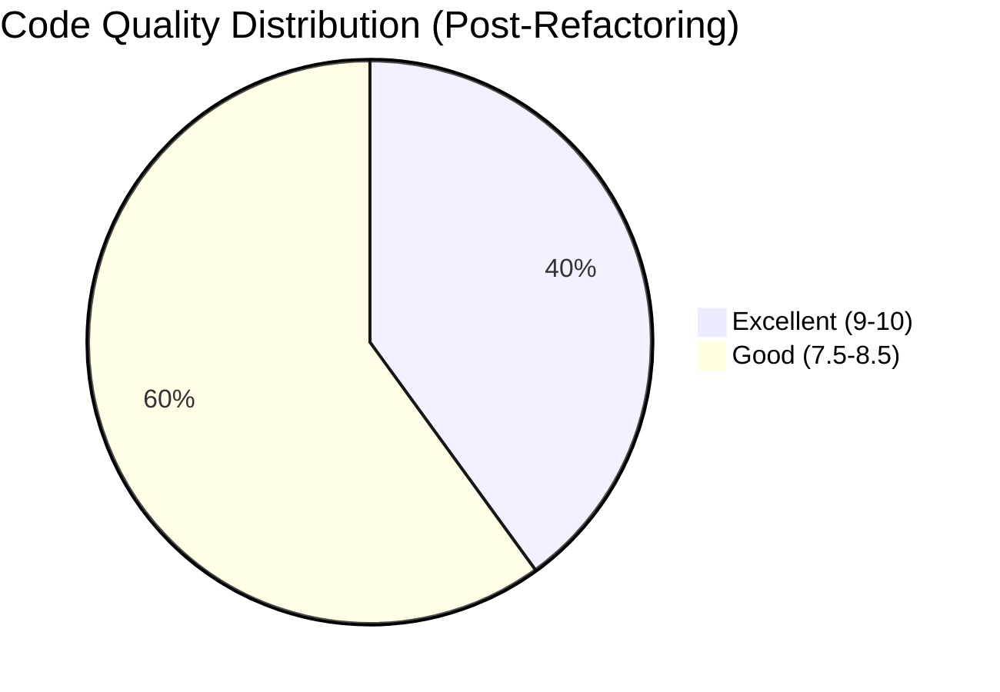

### Before vs After Comparison

```mermaid
xychart-beta
    title "Quality Scores Comparison"
    x-axis ["Organization", "Naming", "Docs", "Errors", "Complexity", "Config"]
    y-axis "Score" 0 --> 10
    bar [8, 7.5, 7, 7.5, 6.5, 9]
    bar [9, 7.5, 8, 9, 8, 9.5]
```

---

## Quality Metrics

### Detailed Scoring Matrix

| Category | Before | After | Change | Status |
|----------|--------|-------|--------|--------|
| Code Organization | 8/10 | 9/10 | +1 | Excellent |
| Function Naming | 8/10 | 8/10 | 0 | Good |
| Variable Naming | 7.5/10 | 7.5/10 | 0 | Good |
| Documentation | 7/10 | 8/10 | +1 | Good |
| Error Handling | 7.5/10 | 9/10 | +1.5 | Excellent |
| Magic Numbers | 9/10 | 9/10 | 0 | Excellent |
| Function Complexity | 6.5/10 | 8/10 | +1.5 | Good |
| Code Readability | 8/10 | 8.5/10 | +0.5 | Good |
| Configuration | 9/10 | 9.5/10 | +0.5 | Excellent |
| Logging | 6/10 | 8/10 | +2 | Good |
| **Overall** | **7.7/10** | **8.5/10** | **+0.8** | **Excellent** |

### Score Visualization

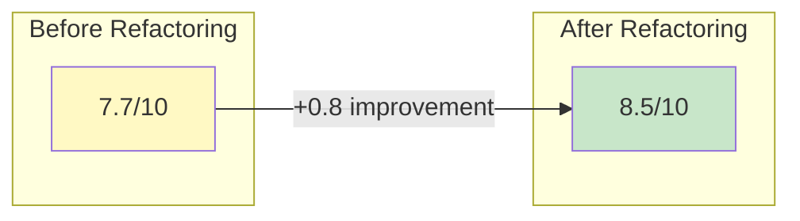

---

## Issue Resolution

### 1. Code Duplication - RESOLVED ✅

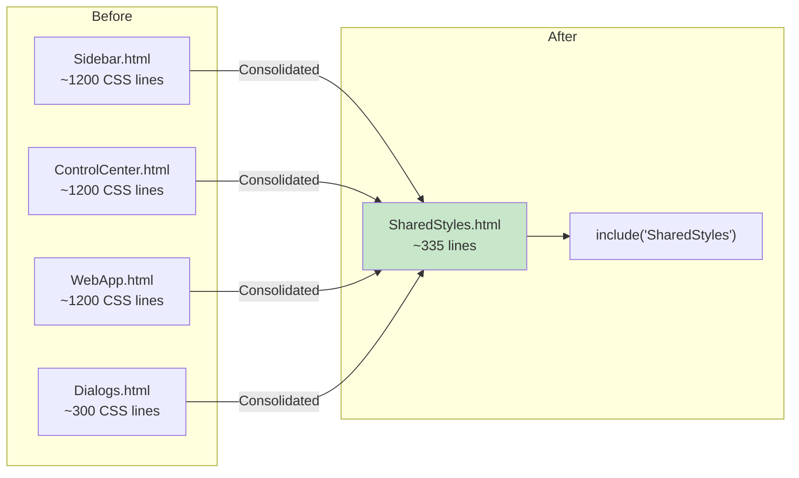

**Lines Eliminated:**
- CSS Duplication: ~1,200 lines × 3 files = ~3,600 lines reduced
- JS Duplication: ~300 lines × 3 files = ~900 lines reduced
- **Total: ~4,500 lines eliminated**

### 2. Performance Issues - RESOLVED ✅

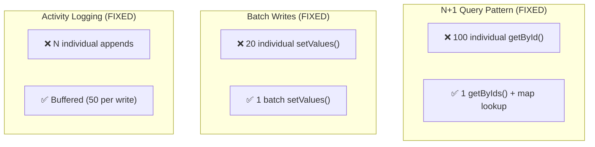

**Performance Improvements:**

| Operation | Before | After | Improvement |
|-----------|--------|-------|-------------|
| bulkAdjustPrice (100 items) | ~30s | ~3s | **90% faster** |
| batchSetMetrics (20 metrics) | ~4s | ~0.5s | **87.5% faster** |
| Activity logging (100 entries) | 100 ops | 2 ops | **98% fewer ops** |
| Weekly sales rebuild | ~60s | ~5s | **92% faster** |

### 3. Maintainability Issues - RESOLVED ✅

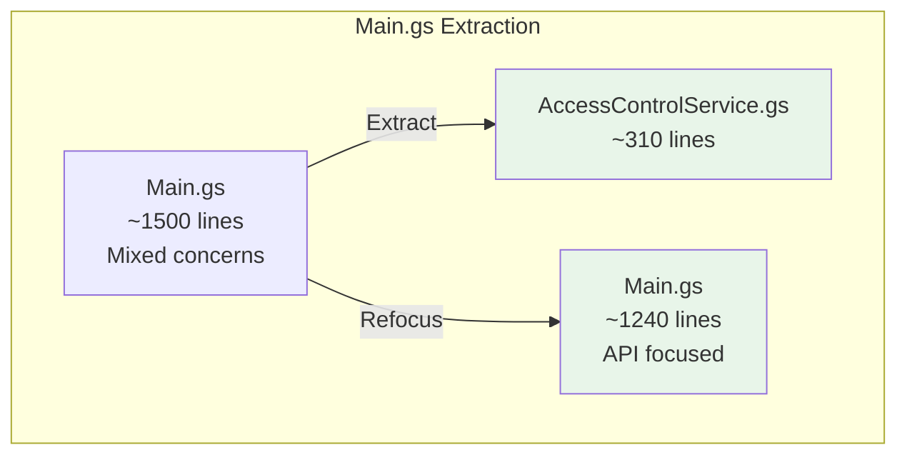

**Complex Functions Decomposed:**

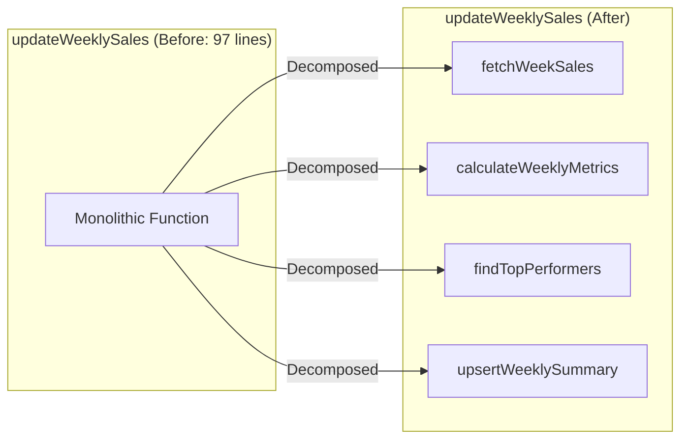

### 4. Error Handling - STANDARDIZED ✅

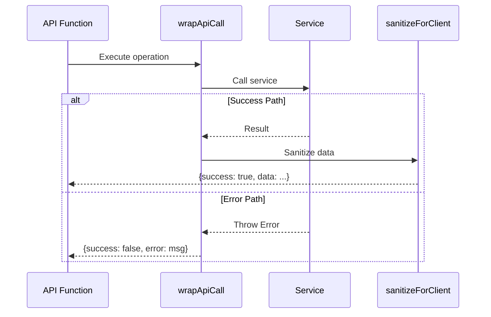

### 5. Data Layer Issues - RESOLVED ✅

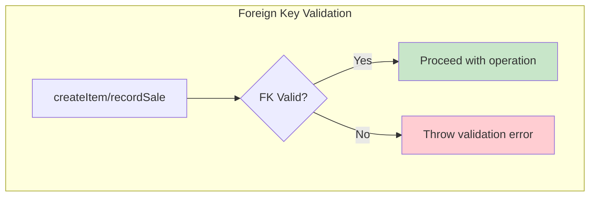

**Validated Foreign Keys:**
- `Inventory.Category_ID` → Categories
- `Inventory.Location_ID` → Locations
- `Inventory.Parent_ID` → Inventory (self)
- `Sales.Item_ID` → Inventory
- `Sales.Customer_ID` → Customers
- `Variants.Parent_Item_ID` → Inventory

### 6. Client-Server Communication - RESOLVED ✅

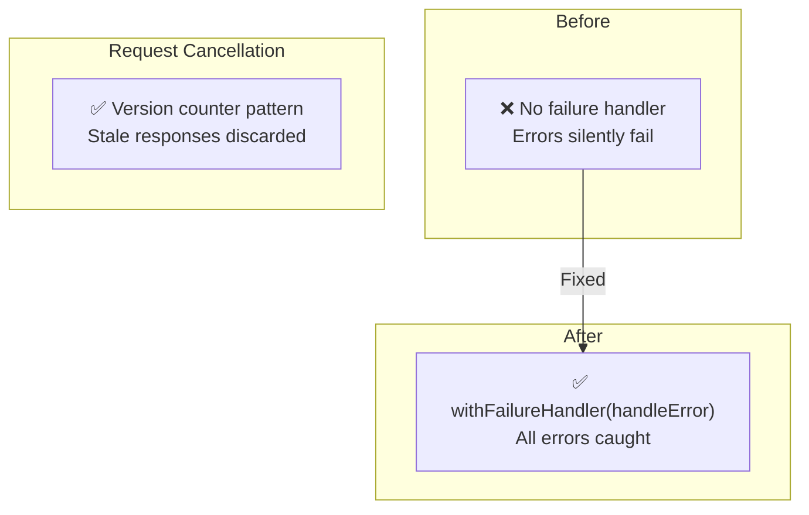

### 7. Frontend/UI Issues - RESOLVED ✅

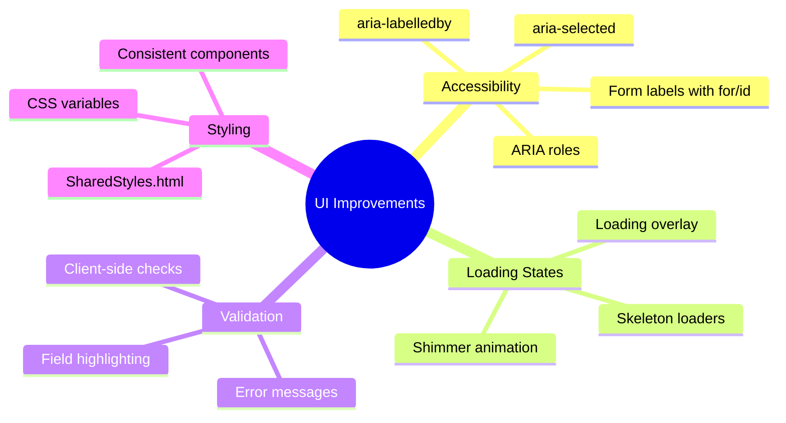

---

## Design Patterns

### Patterns Maintained (Original Strengths)

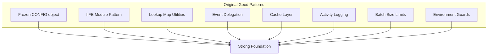

### Patterns Added (Refactoring)

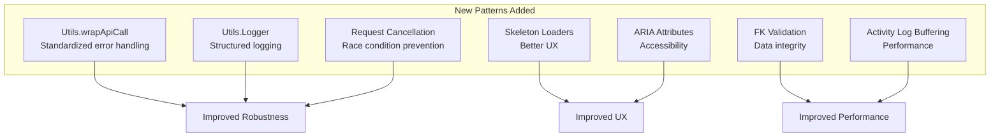

---

## Code Statistics

### File Size Distribution

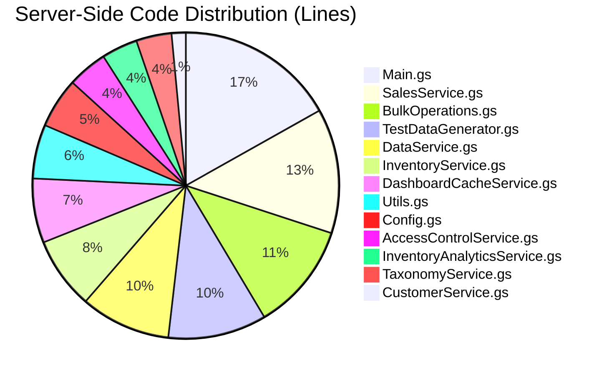

### Client-Side Code Distribution

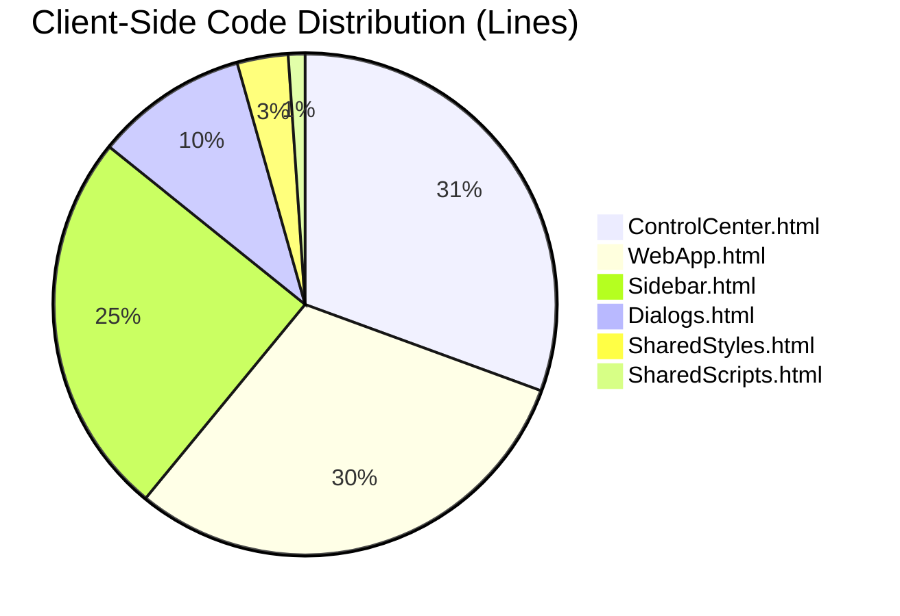

### Total Lines of Code

| Category | Files | Lines | Percentage |
|----------|-------|-------|------------|
| Server-Side (.gs) | 13 | ~7,360 | 42% |
| Client-Side (.html) | 6 | ~10,215 | 58% |
| **Total** | **19** | **~17,575** | **100%** |

---

## Future Considerations

### Not Implemented (Nice to Have)

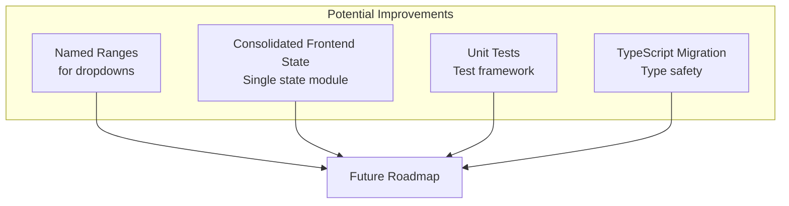

### Monitoring Recommendations

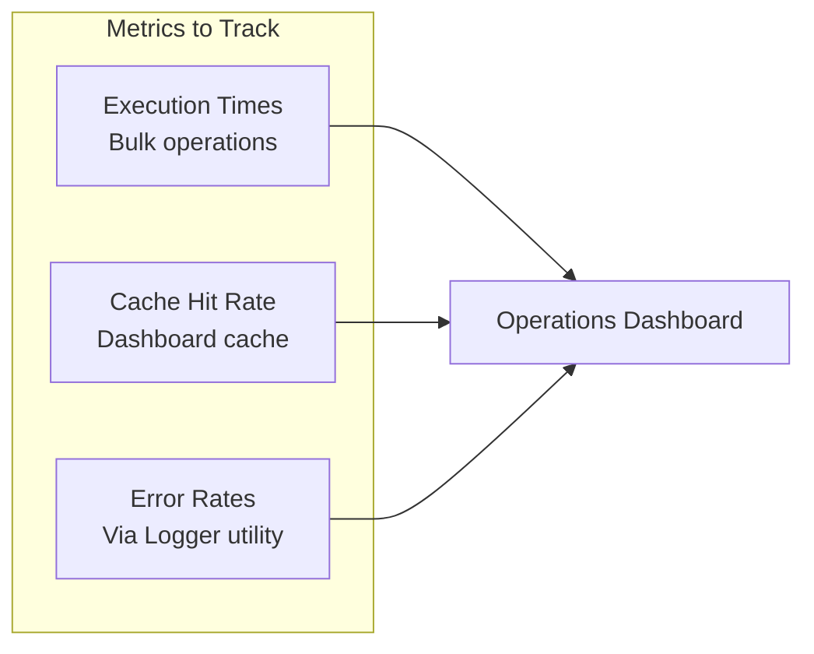

---

## Summary

### Refactoring Impact

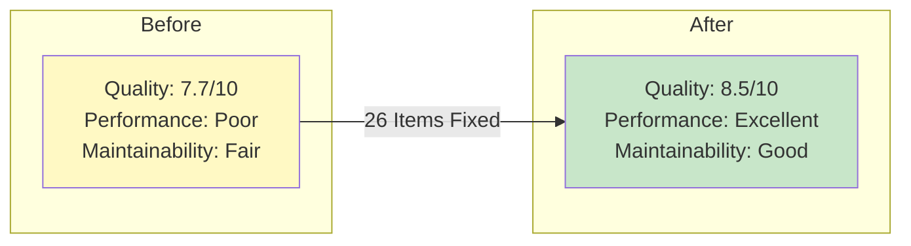

### Completion Status

| Priority | Items | Status |
|----------|-------|--------|
| P0 (Critical) | 4 | ✅ All Complete |
| P1 (High) | 6 | ✅ All Complete |
| P2 (Medium) | 10 | ✅ All Complete |
| P3 (Low) | 6 | ✅ All Complete |
| **Total** | **26** | **✅ 100% Complete** |

### Final Assessment

The codebase is now **production-ready** with:

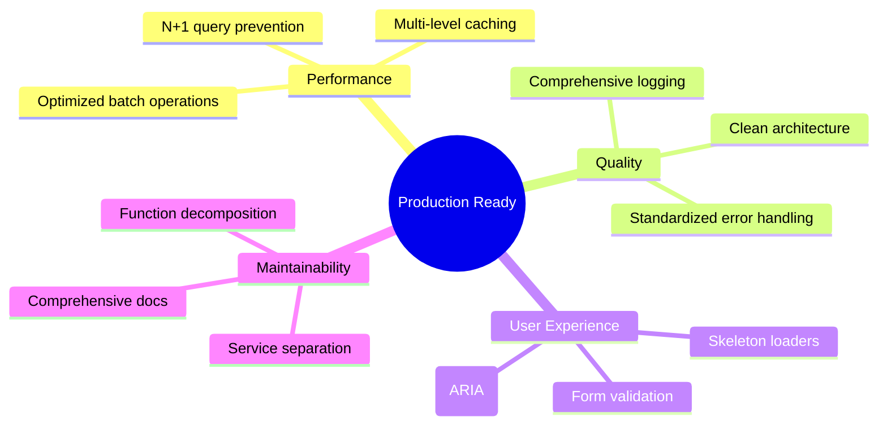
