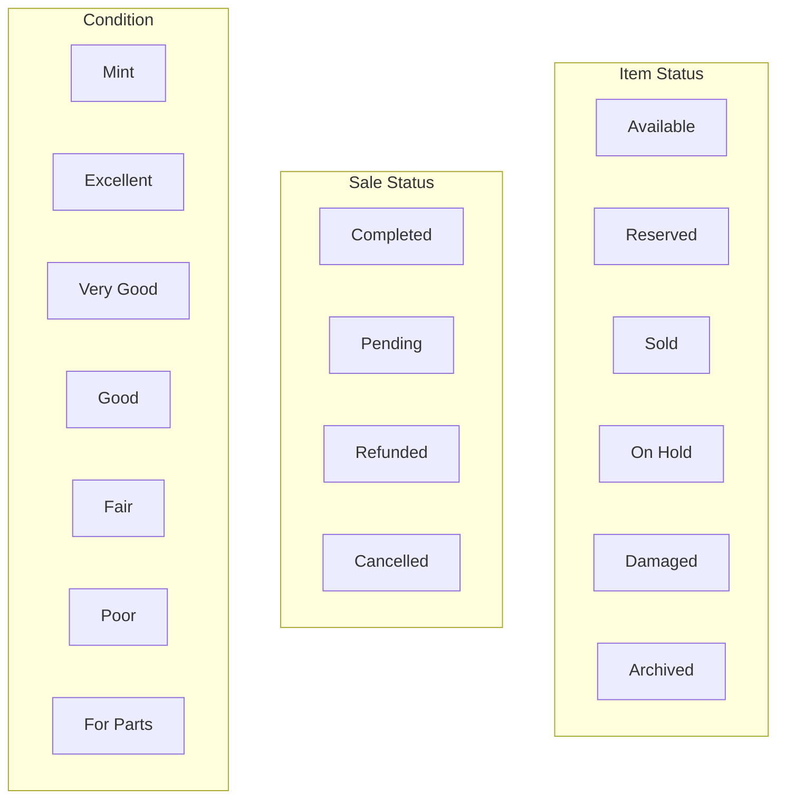

# Database Schema Documentation

> **Version:** 2.1.0
> **Last Updated:** December 2024
> **Storage:** Google Sheets (14 sheets)

---

## Table of Contents

- [Overview](#overview)
- [Entity Relationship Diagram](#entity-relationship-diagram)
- [Sheet Definitions](#sheet-definitions)
- [Data Types & Validation](#data-types--validation)
- [Foreign Key Relationships](#foreign-key-relationships)
- [Business Rules](#business-rules)
- [ID Generation](#id-generation)

---

## Overview

The Rosewood Antiques system uses Google Sheets as its database, with 14 sheets organized into logical domains.

### Sheet Categories


---

## Entity Relationship Diagram

### Complete ER Diagram


---

## Sheet Definitions

### Core Entities

#### Inventory Sheet

The primary entity storing all inventory items.


| Column | Type | Constraints | Description |
|--------|------|-------------|-------------|
| **Item_ID** | string | PK, Auto | Format: INV-{timestamp}-{random} |
| **Name** | string | Required, max 200 | Item name |
| **Description** | string | max 2000 | Detailed description |
| **Category_ID** | string | FK → Categories | Category reference |
| **Parent_ID** | string | FK → Inventory | For hierarchical items |
| **SKU** | string | - | Stock keeping unit |
| **Condition** | enum | Validation | Mint, Excellent, Very Good, Good, Fair, Poor, For Parts |
| **Era** | enum | Validation | Pre-1800, 1800-1850, 1850-1900, 1900-1950, 1950-1980, Modern |
| **Price** | number | max 1,000,000 | Selling price |
| **Cost** | number | max 1,000,000 | Acquisition cost |
| **Quantity** | number | max 100,000 | Stock quantity |
| **Location_ID** | string | FK → Locations | Storage location |
| **Status** | enum | Validation | Available, Reserved, Sold, On Hold, Damaged, Archived |
| **Date_Added** | datetime | Auto | Creation timestamp |
| **Date_Modified** | datetime | Auto | Last update timestamp |
| **Notes** | string | max 5000 | Additional notes |

#### Variants Sheet

Size/color/material variations of inventory items.

| Column | Type | Constraints | Description |
|--------|------|-------------|-------------|
| **Variant_ID** | string | PK, Auto | Format: VAR-{timestamp}-{random} |
| **Parent_Item_ID** | string | FK → Inventory, Required | Parent item |
| **Variant_Type** | enum | Validation | Size, Color, Material, Finish, Style |
| **Variant_Value** | string | - | Specific value (e.g., "Large", "Red") |
| **SKU_Suffix** | string | - | Appended to parent SKU |
| **Price_Modifier** | number | - | Added to parent price |
| **Quantity** | number | max 100,000 | Stock for variant |
| **Status** | enum | Validation | Available, Reserved, Sold, etc. |

#### Bundles & Bundle_Items

Product bundles (kits, sets) with component items.

**Bundles:**

| Column | Type | Constraints | Description |
|--------|------|-------------|-------------|
| **Bundle_ID** | string | PK, Auto | Format: BND-{timestamp}-{random} |
| **Name** | string | Required | Bundle name |
| **Description** | string | max 2000 | Bundle description |
| **Bundle_Price** | number | - | Total bundle price |
| **Discount_Percent** | number | 0-100 | Bundle discount |
| **Status** | enum | Validation | Available, Sold, etc. |
| **Date_Created** | datetime | Auto | Creation timestamp |

**Bundle_Items (Junction Table):**

| Column | Type | Constraints | Description |
|--------|------|-------------|-------------|
| **Bundle_ID** | string | FK → Bundles | Bundle reference |
| **Item_ID** | string | FK → Inventory | Item reference |
| **Quantity** | number | Positive int | Quantity in bundle |

---

### Taxonomy

#### Categories Sheet (Hierarchical)


| Column | Type | Constraints | Description |
|--------|------|-------------|-------------|
| **Category_ID** | string | PK, Auto | Format: CAT-{timestamp}-{random} |
| **Name** | string | Required, max 200 | Category name |
| **Parent_Category_ID** | string | FK → Categories | Parent for hierarchy |
| **Description** | string | max 2000 | Category description |
| **Sort_Order** | number | Positive int | UI display order |

#### Locations Sheet

| Column | Type | Constraints | Description |
|--------|------|-------------|-------------|
| **Location_ID** | string | PK, Auto | Format: LOC-{timestamp}-{random} |
| **Name** | string | Required, max 200 | Location name |
| **Description** | string | max 2000 | Location details |
| **Capacity** | number | max 9999 | Maximum items |
| **Current_Count** | number | Computed | Items with Status=Available |

#### Tags & Item_Tags

**Tags:**

| Column | Type | Constraints | Description |
|--------|------|-------------|-------------|
| **Tag_ID** | string | PK, Auto | Format: TAG-{timestamp}-{random} |
| **Name** | string | Required | Tag label |
| **Color** | string | Hex color | Display color (default: #00D9FF) |

**Item_Tags (Many-to-Many Junction):**

| Column | Type | Constraints | Description |
|--------|------|-------------|-------------|
| **Item_ID** | string | FK → Inventory | Item reference |
| **Tag_ID** | string | FK → Tags | Tag reference |

---

### Transactions

#### Sales Sheet


| Column | Type | Constraints | Description |
|--------|------|-------------|-------------|
| **Sale_ID** | string | PK, Auto | Format: SLE-{timestamp}-{random} |
| **Date** | datetime | Required | Transaction date |
| **Week_ID** | string | Computed | Format: YYYY-WNN |
| **Customer_ID** | string | FK → Customers | Customer reference |
| **Item_ID** | string | FK → Inventory | Item sold |
| **Variant_ID** | string | FK → Variants | Variant sold (optional) |
| **Bundle_ID** | string | FK → Bundles | Bundle sold (optional) |
| **Quantity** | number | Positive int | Quantity sold |
| **Unit_Price** | number | Positive | Price per unit |
| **Total** | number | Computed | Quantity × Unit_Price |
| **Payment_Method** | enum | Validation | Cash, Credit Card, Debit, Check, PayPal, Venmo, Other |
| **Status** | enum | Validation | Completed, Pending, Refunded, Cancelled |
| **Notes** | string | max 5000 | Transaction notes |

#### Weekly_Sales Sheet (Aggregation)

| Column | Type | Constraints | Description |
|--------|------|-------------|-------------|
| **Week_ID** | string | PK | Format: YYYY-WNN (e.g., 2024-W52) |
| **Week_Start** | date | - | First day of week |
| **Week_End** | date | - | Last day of week |
| **Total_Revenue** | number | Computed | Sum of sale totals |
| **Total_Cost** | number | Computed | Sum of item costs |
| **Gross_Profit** | number | Computed | Revenue - Cost |
| **Items_Sold** | number | Computed | Total quantity |
| **Transactions** | number | Computed | Sale count |
| **Avg_Transaction** | number | Computed | Revenue / Transactions |
| **Top_Category** | string | Computed | Best selling category |
| **Top_Item** | string | Computed | Best selling item |

#### Customers Sheet

| Column | Type | Constraints | Description |
|--------|------|-------------|-------------|
| **Customer_ID** | string | PK, Auto | Format: CUS-{timestamp}-{random} |
| **Name** | string | Required, max 200 | Customer name |
| **Email** | string | - | Email address |
| **Phone** | string | - | Phone number |
| **Address** | string | max 2000 | Full address |
| **Preferred_Contact** | enum | Validation | Email, Phone |
| **Total_Purchases** | number | Computed | Lifetime spend |
| **Last_Purchase** | datetime | Computed | Most recent sale |
| **Notes** | string | max 5000 | Customer notes |

---

### System

#### Settings Sheet

| Column | Type | Description |
|--------|------|-------------|
| **Key** | string | Unique setting name |
| **Value** | string | Setting value |
| **Description** | string | Setting explanation |

#### Activity_Log Sheet

| Column | Type | Description |
|--------|------|-------------|
| **Timestamp** | datetime | Auto-set on entry |
| **Action** | string | CREATE, UPDATE, DELETE, BATCH_CREATE, etc. |
| **Entity_Type** | string | Sheet name being modified |
| **Entity_ID** | string | Record ID affected |
| **Details** | string | JSON of operation details |
| **User** | string | Email of user performing action |

#### Dashboard_Cache Sheet

| Column | Type | Description |
|--------|------|-------------|
| **Metric_Key** | string | Unique cache identifier |
| **Value** | string | Cached value (JSON for objects) |
| **Last_Updated** | datetime | Cache timestamp |
| **Expiry_Seconds** | number | TTL in seconds |
| **Category** | string | Metric grouping (quick_stats, health, etc.) |

---

## Data Types & Validation

### String Validation


| Type | Max Length | Validation |
|------|------------|------------|
| Name | 200 | Required, sanitized |
| Description | 2,000 | Sanitized |
| Notes | 5,000 | Sanitized |
| SKU | 200 | Sanitized |

### Numeric Validation

| Type | Min | Max | Validation |
|------|-----|-----|------------|
| Price | 0 | 1,000,000 | Positive number |
| Cost | 0 | 1,000,000 | Positive number |
| Quantity | 0 | 100,000 | Positive integer |
| Capacity | 0 | 9,999 | Positive integer |

### Enum Values



---

## Foreign Key Relationships

### Relationship Map


### Validation Rules

| Foreign Key | Validated On | Error Message |
|-------------|--------------|---------------|
| Inventory.Category_ID | createItem, updateItem | "Invalid Category_ID: {id}" |
| Inventory.Location_ID | createItem, updateItem | "Invalid Location_ID: {id}" |
| Inventory.Parent_ID | createItem | "Invalid Parent_ID: {id}" |
| Sales.Item_ID | recordSale | "Invalid Item_ID: {id}" |
| Sales.Customer_ID | recordSale | "Invalid Customer_ID: {id}" |
| Variants.Parent_Item_ID | addVariant | "Invalid Parent_Item_ID: {id}" |

---

## Business Rules

### Inventory Aging


### Health Score Calculation


### Action Item Thresholds

| Alert Type | Criteria | Priority |
|------------|----------|----------|
| **Stale High-Value** | 180+ days AND Price ≥ $200 | High |
| **Aging Inventory** | 90+ days listed | Medium |
| **Slow Categories** | 5+ items, 0 sales in 90 days | Medium |
| **Low Margin** | Margin < 30% AND 60+ days | Low |

### Cascading Operations


---

## ID Generation

### Format

All auto-generated IDs follow this pattern:

```
{PREFIX}-{TIMESTAMP}-{RANDOM}
```

| Entity | Prefix | Example |
|--------|--------|---------|
| Inventory | INV | INV-1703894400000-abc123 |
| Variants | VAR | VAR-1703894400000-def456 |
| Bundles | BND | BND-1703894400000-ghi789 |
| Categories | CAT | CAT-1703894400000-jkl012 |
| Locations | LOC | LOC-1703894400000-mno345 |
| Tags | TAG | TAG-1703894400000-pqr678 |
| Sales | SLE | SLE-1703894400000-stu901 |
| Customers | CUS | CUS-1703894400000-vwx234 |

### Generation Code

```javascript
function generateId(prefix) {
  const timestamp = Date.now();
  const random = Math.random().toString(36).substring(2, 8);
  return `${prefix}-${timestamp}-${random}`;
}
```

---

## Computed Fields

### Location.Current_Count

Calculated as count of items where:
- `Location_ID` matches the location
- `Status` = "Available"

Updated on:
- Item creation
- Item deletion
- Item location change
- Item status change

### Customer.Total_Purchases

Sum of all `Sales.Total` where:
- `Customer_ID` matches the customer
- `Status` = "Completed"

Updated on:
- Sale creation
- Sale cancellation/refund

### Customer.Last_Purchase

Most recent `Sales.Date` where:
- `Customer_ID` matches the customer
- `Status` = "Completed"

### Weekly_Sales (All Fields)

Aggregated from Sales records:
- Grouped by `Week_ID`
- Filtered by `Status` = "Completed"
- Computed nightly or on-demand

---

## Index Strategy

While Google Sheets doesn't support traditional database indexes, the following optimization patterns are used:

### Lookup Maps

```javascript
// Build once, use many times
const itemsMap = Utils.buildLookupMap(items, 'Item_ID');

// O(1) lookup instead of O(n) filter
const item = itemsMap[itemId];
```

### Caching

```javascript
// Cache full sheet data with TTL
const cached = cache.get('RS_Inventory');
if (cached) return JSON.parse(cached);
```

### Pagination

```javascript
// Read only needed rows
const startRow = 2 + (page - 1) * pageSize;
sheet.getRange(startRow, 1, pageSize, cols).getValues();
```
